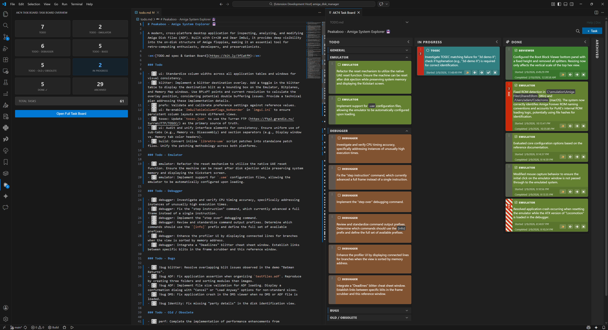

# AK74: TODO.md Kanban Task Board

AK74 is a collection of tools that help developers program efficiently.

> **Note:** This is a fork of the original [Coddx](https://github.com/coddx-hq/coddx-alpha) project, enhanced with multi-line tasks, categories, automated timestamps, and a modern UI.

AK74 manages tasks and save them as [TODO.md](https://bit.ly/2JdEuET) - a simple plain text file.

## Features

- **Multi-line Tasks:** Support for tasks spanning multiple lines.
- **Categories:** Use `category:` prefix for automatic color-coding.
- **Timestamps:** Automated `Added:`, `Started:`, and `Completed:` timestamps.
- **Kanban Interface:** Drag and drop tasks between columns.
- **Markdown Compatible:** The syntax is compatible with [Github Markdown](https://bit.ly/2wBp1Mk).
- **Portable:** TODO.md file is portable and can be committed with Pull Requests (PRs).
- **Customizable:** Support custom file name, multiple task lists.
- **Rich Title:** Task title can also have markdown for styling, hyperlinks, simple html or even img tags.

## Usage:

- Open AK74 Task Board:
  - Bring up the Command Palette (F1), type and select: **AK74: TODO.md Kanban Task Board**.
- When interacting with the Task Board, TODO.md will be created or updated automatically.
- Vice versa, TODO.md can be edited manually, Task Board will load it every time (click the Refresh icon or Save the file).

## Support

- For Feedbacks, Bug Reports: https://github.com/AdamKeher/coddx-alpha/issues
- <a href="https://github.com/AdamKeher/coddx-alpha/blob/master/CHANGELOG.md">CHANGELOG</a>

## Credits:

Original project by [Coddx](https://github.com/coddx-hq/coddx-alpha).
